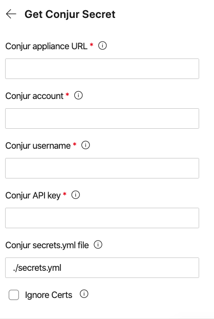

## How to use

DO NOT STORE THE CONJUR API KEY IN PLAIN TEXT. Store the conjur api key either in the Azure Key Vault or as a secret variable on the pipeline.

## Available tasks

Azure DevOps

* **GetConjurSecret**: Retrieve secrets from conjur and set them as pipeline variable secrets

## Get the source

The [source](https://github.com/cyberark/conjur-azure-devops-extension) for this extension is on GitHub. Take, fork, and extend.

## Contribute

This extension was created by [Andrew Copeland](https://github.com/AndrewCopeland).

## Feedback and issues

If you have feedback or issues file an issue on [GitHub](https://github.com/cyberark/conjur-azure-devops-extension)
